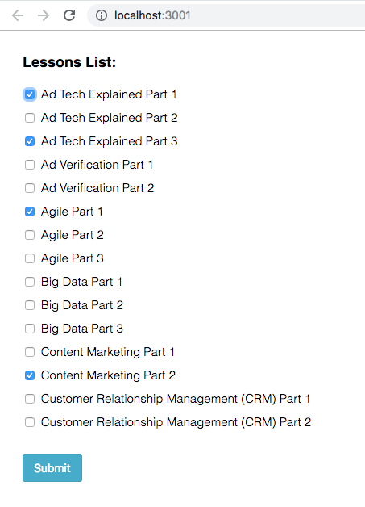
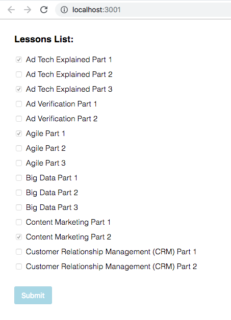

# Circus Street React Exercise

This is a read-only repo. Please fork to your own github and commit your changes there.

## Description:

We want to build a small app that will give us a list of lessons to select and then submit to an API. 
For the purposes of this exercise, the API does not exist so we are faking an async request by just waiting before returning a successful response.
After "sending the data to the API" - which you can just use a timeout for, the page must disable any further interaction before the 'response' is received. Once the successful response is received, the page can enable again, allowing you do make changes and submit you selection again.
The format of the selected lessons to send to the API should be as follows:
POST: http://fakeapi.circusstreet.com/ (this does not exist but you can use the address for the sake of argument)
BODY: 
```{
  lessonIds:[61,62,63]
}```

### Designs:
Here are the 3 states for the app:

1. Initial state 


2. Some lessons selected


3. Saving the selected lessons 


## Files:

You will find the following files in the src dir. Some of these files are complete and you will not need to change them and in the other files you will need to add some code to make the app work as desired.

In the test suite there are also a few tests for you to write to test some of your code

### No need to change these:
* all-lessons.json: lesson fixture data
* index.js: main setup file is set up for you
* reducer.js: the root reducer
* setupTests.js: test setup file

### Code will need adding to these files:
* CheckboxList.component.js
* SelectedLessons.component.js: the main connected component view
* SelectedLessons.component.test.js: the test suite for the SelectedLessons component
* selectedLessons.reducer.js: the reducer for selected lessons
* styles.scss: the SASS
* updateSelectedLessons.action.js

These files are in place as a guide to help, but don't feel you need to rigidly stick to this. Feel free to add code anywhere you like to make this work the way you think it should. If you want to place code in new files, create them, if you don't need the existing one, delete them!

## Getting started:

Please start by forking this repo to your own account.

Then clone the repo into your local environment

run `npm i` to get the dependencies

run `npm start` to start the app

run `npm test` to run the test suite 

Make commits at any point you feel appropriate

Once you are satisfied with your work, push the code up to the repo on your own account and give us access.

Good Luck!